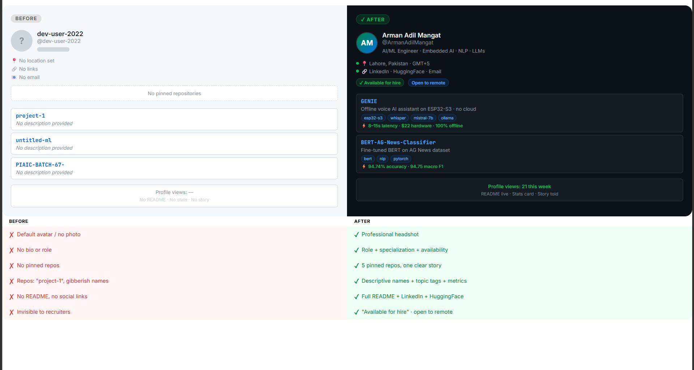

# 🚀 GitHub Profile Blueprint

> **A complete, steal-ready checklist + template for turning a dead GitHub profile into a developer brand that gets noticed.**

Built by [Arman Adil Mangat](https://github.com/ArmanAdilMangat) — AI/ML Engineer, UMT Lahore.  
Went from zero profile views to recruiter DMs in under a week. Here's exactly what I changed.

---

## 📸 Before vs After

| Before | After |
|--------|-------|
| Default GitHub avatar | Professional headshot |
| No bio | Role + specialization + availability |
| No pinned repos | 5 pinned repos telling one story |
| Repos named `project-1`, `untitled` | Descriptive names + topic tags |
| No README | Full profile README with metrics |
| No social links | LinkedIn · HuggingFace · Email visible |
| No location / timezone | Lahore, Pakistan · GMT+5 |

---

## ✅ The Complete Checklist

### 1. Profile Basics
- [ ] Upload a **real, clear headshot** (not AI-generated, not cartoon)
- [ ] Set your **name** (not just username)
- [ ] Write a **bio** — max 2 lines: role + what you're building + "open to remote roles"
- [ ] Add **location** (city, country)
- [ ] Add your **email** (public)
- [ ] Link **LinkedIn**, portfolio, or HuggingFace
- [ ] Enable **"Available for hire"** in settings if you're job hunting

### 2. Profile README (`username/username` repo)
- [ ] Greeting + name + role
- [ ] What you're currently building (1 liner)
- [ ] Badges for socials (LinkedIn, HuggingFace, email, etc.)
- [ ] Tech stack badges (shields.io)
- [ ] Featured project section (your flagship, with metrics)
- [ ] GitHub stats card
- [ ] Keep it **under 150 lines** — recruiters skim

### 3. Pinned Repositories (max 6)
- [ ] Pin **exactly 5–6 repos** — no more, no less
- [ ] Every pinned repo has a **description** (1 sentence, with a metric if possible)
- [ ] Every pinned repo has **topic tags** (language, framework, domain)
- [ ] Repos tell a **single coherent story** about what you do
- [ ] Remove or unpin anything half-finished with no README

### 4. Repository READMEs
- [ ] Every pinned repo has a proper README with:
  - What it does (1–2 sentences)
  - Tech stack used
  - Key results / metrics (accuracy %, latency, etc.)
  - How to run it
  - Screenshot or demo (if applicable)
- [ ] Use **badges** for build status, license, language

### 5. Repo Housekeeping
- [ ] Rename repos with underscores or gibberish to clean, readable names
- [ ] Add a **license** to serious projects (MIT is fine)
- [ ] Archive or delete dead/empty repos
- [ ] Add topic tags to ALL repos (not just pinned)

### 6. Activity Signal
- [ ] Pin your **most impressive repo first** (top-left slot)
- [ ] Aim for consistent commit activity — even docs commits count
- [ ] Use **meaningful commit messages** (not "update" or "fix")

---

## 📋 Profile README Template

Fork this and fill in the placeholders:

```markdown
# Hi, I'm [Your Name] 👋

**[Your Role] · [Specialization 1] · [Specialization 2] · [Specialization 3]**

[1-line description of what you build and why it matters]

[](YOUR_LINKEDIN_URL)
[](YOUR_HF_URL)
[](mailto:YOUR_EMAIL)


---

## 🎯 About Me

- 🔭 Currently building **[YOUR FLAGSHIP PROJECT]** — [one line description]
- 🎓 [Degree] at [University] ([year])
- 🌍 Based in [City, Country] · Open to remote roles in [regions]
- 💡 Specialization: [area 1] + [area 2] — [what makes you unique]

---

## 🚀 Featured Project — [PROJECT NAME]

> *"[One punchy quote about what it does or why it matters]"*

**[Project link]** · [Tag 1] · [Tag 2]

[2–3 sentences: what it does, how it works, key result]

- ⚡ **[Metric 1]:** [value] (e.g. 94.74% accuracy)
- 🔧 **Stack:** [tools]
- 💰 **Cost:** [value] (e.g. $22 hardware, zero cloud)

---

## 🛠️ Tech Stack

**Languages**


**AI / ML**


**Tools**


---

## 📊 GitHub Stats


---

*Open to remote AI/ML roles · [City, Country] · [Email]*
```

---

## 🔖 Useful Resources

- [Shields.io](https://shields.io) — badges for everything
- [GitHub README Stats](https://github.com/anuraghazra/github-readme-stats) — stats cards
- [Profile Views Counter](https://github.com/antonkomarev/github-profile-views-counter)
- [Simple Icons](https://simpleicons.org) — brand logos for badges

---

## ⭐ If this helped you

Star this repo so more developers find it.  
Connect on [LinkedIn](YOUR_LINKEDIN) — I post about AI/ML, embedded systems, and developer career stuff.

---

*MIT License · Made in Lahore, Pakistan 🇵🇰*
